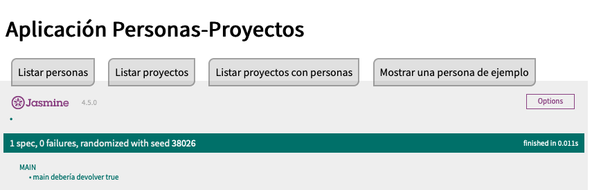
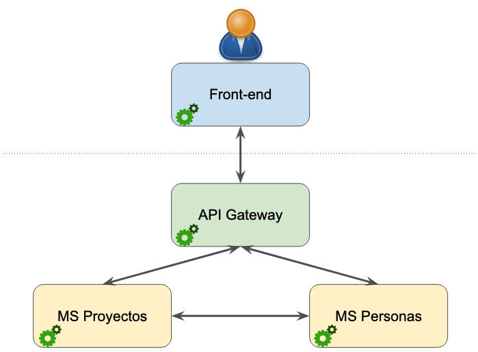
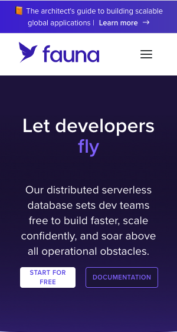
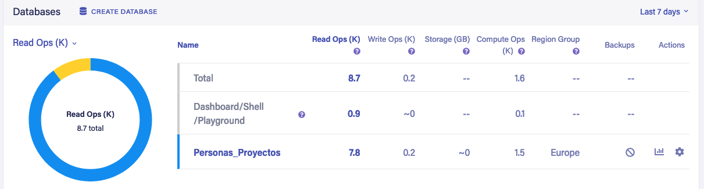
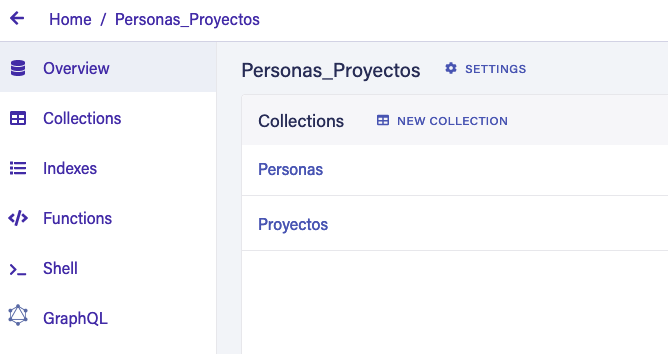
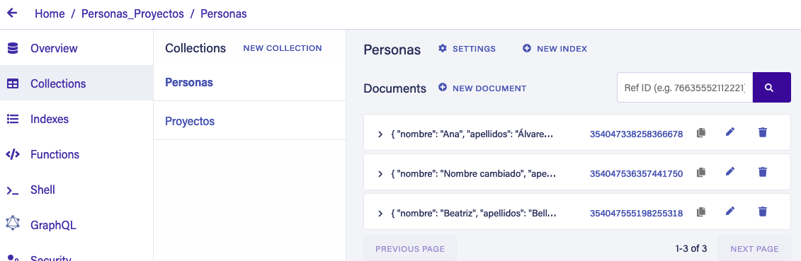
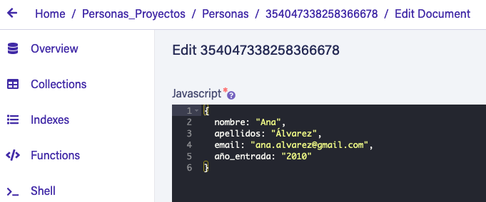

# Descripción de la aplicación PERSONAS-PROYECTOS basada en MICROSERVICIOS

Esta aplicación se hace para explicar cómo vamos a implementar los microservicios en las prácticas de Desarrollo Ágil, para el curso 2022-2023.

## Funcionamiento básico de la aplicación
La funcionalidad es muy simple: hay un conjunto de personas asignadas a un conjunto de proyectos (de software). Y la aplicación permite listar tanto las personas que hay como los proyectos, así como modificar los datos de las personas.



*Pantalla de inicio de la aplicación* &#8593;

Esta aplicación de muestra está formada, a su vez, por 4 aplicaciones (=servidores) independientes:
* Aplicación *front-end*
* Aplicación *api-gateway*
* Aplicación *ms-personas* (un microservicio)
* Aplicación *ms-proyectos* (otro microservicio)

Se respetan siempre las siguientes reglas básicas:
1. El usuario solo interactúa con la aplicación *front-end*
2. La aplicación *front-end* solo interactía con la aplicación *api-gateway*
3. La aplicación *api-gateway* recibe peticiones de *front-end* y las deriva al microservicio correspondiente. El servicio resuelve la petición y envía el resultado a la aplicación *front-end* a través de *api-gateway*
4. Los microservicios interactúan con una BBDD (posiblemente distinta para cada microservicio), con *api-gateway* y también entre ellos.
   
 

*Esquema de comunicación entre las distintas aplicaciones.* &#8593;

## Ejecución de la aplicación

Más que hablar de ejecución de la aplicación deberíamos hablar de ejecución de **las aplicaciones**, dado que son 4.

Para poder disfrutar de toda la funcionalidad de la aplicación, necesitamos abrir 4 consolas de línea de comandos. En cada una de ellas, tendremos que meternos en un directorio correspondiente a una aplicación y posteriormene ejecutar:
```npm start```

El resultado debería ser parecido a este:

*Consola de front-end:*
```
front-end % npm start

> front-end@1.0.0 start
> node server.js

Aplicación Front-End escuchando en puerto 8000!
```

*Consola de api-gateway:*
```
fapi-gateway % npm start

> api-gateway@1.0.0 start
> node server.js

[HPM] Proxy created: /  -> http://localhost:8002
[HPM] Proxy rewrite rule created: "^/personas" ~> ""
[HPM] Proxy created: /  -> http://localhost:8003
[HPM] Proxy rewrite rule created: "^/proyectos" ~> ""
Aplicación API-Gateway escuchando en 8001!
```

*Consola de api-gateway:*
```
fapi-gateway % npm start

> api-gateway@1.0.0 start
> node server.js

[HPM] Proxy created: /  -> http://localhost:8002
[HPM] Proxy rewrite rule created: "^/personas" ~> ""
[HPM] Proxy created: /  -> http://localhost:8003
[HPM] Proxy rewrite rule created: "^/proyectos" ~> ""
Aplicación API-Gateway escuchando en 8001!
```
*Consola de ms-personas:*
```
ms-personas % npm start

> ms-personas@1.0.0 start
> node server.js

Microservicio PERSONAS ejecutándose en puerto 8002!
```

*Consola de ms-proyectos:*
```
ms-proyectos % npm start

> ms-proyectos@1.0.0 start
> node server.js

Microservicio PROYECTOS ejecutándose en puerto 8003!
```

## Organización del árbol de directorios de cada app

Las cuatro apps que forman el sistema completo tienen su código por separado y no comparten nada de dicho código.

No obstante, todas tres de ellas (*ms-proyectos*, *ms-personas* y *front-end*) tienen un conjunto de directorios y de ficheros con nombres idénticos (aunque con contenidos distintos). Solo la app *api-gateway* es un poco distinta, por el hecho de que se limita a redireccionar las llamadas que le llegan enviándolas al microservicio correspondiente.

Describimos brevemente los ficheros y directorios que se encuentran en estas apps:
* ```server.js```: fichero en el que se declara el objeto ```app```, el cual hace las veces de servidor web; es decir, recibe llamadas a través del protocolo *http* y devuelve un resultado que puede ser en JSON o como fichero HTML (este formato solo lo devuelve la app *front-end*). Las cuatro aplicaciones desarrolladas utilizan la biblioteca [Express](https://expressjs.com/) para [Node.js](https://nodejs.org/en/).
* ```routes.js```: fichero en el que se declaran las rutas que se van a atender dentro de la llamada *http* que se está realizando. En la aplicación *api-gateway* este fichero cambia su nombre a ```proxy-routes.js```.
* ```callbacks.js```: fichero en el que se encuentran las funciones con las que se va a procesar la llamada a cada una de las rutas definidas en *routes.js*. El fichero ```calbacks.js``` **no existe** en la aplicación *api-gateway* dado que no es necesario que esta aplicación genere ni procese resultados; solamente reenvía lo que recibe hacia y desde el *fron-end* hacia los microservicios.
* ```spec```: directorio en el que se encuentran las pruebas a realizar con el entorno [Jasmine](https://jasmine.github.io/), para realizar TDD con JavaScript.
* ```package.json```: fichero con la configuración de cada app, necesario para que *nodejs* pueda ejecutar el proyecto.
* ```README.md```: fichero con la descripción de cada proyecto, el cual a su vez sirve como documentación del mismo.


  
 
 *Árbol de directorios y ficheros de una de las aplicaciones* &#8593;

Pasemos a ver alguno de estos ficheros con algo más de detalle.

### Fichero ```server.js```
Este fichero es el que se ejecuta al lanzar la aplicación y contiene apenas una líneas para configurar el servidor ([Express](https://expressjs.com/)) y dejarlo escuchando en el puerto seleccionado:

```
/**
 * @file server.js
 * @description Define el servidor que aceptará las peticiones para el MS Proyectos
 * @author Víctor M. Rivas <vrivas@ujaen.es>
 * @date 03-feb-2023
 */
const express = require("express");
const routes = require("./routes");
const app = express();
const port = 8003;
app.use("/", routes);


app.listen(port, () => {
    console.log(`Microservicio PROYECTOS ejecutándose en puerto ${port}!`);
});


module.exports = app
```
*Ejemplo de fichero ```server.js``` del microservicio Proyectos*

Hay que tener en cuenta que en la aplicación *api-gateway* este fichero NO EXISTE, y en su lugar se define un objeto *proxy* que redirige las llamadas a los distintos microservicios. 

### Fichero ```routes.js```
Como se observa en el fichero ```server.js```, el servidor hace uso del módulo *routes* el cual define las rutas (paths, URLs) a los que nuestro servidor va a responder.

En el caso de la aplicación *api-gateway* este fichero ```routes.js``` no existe, y en su lugar se utiliza un fichero ```proxy-routes.js``` en el que se indican las reglas que debe seguir el *proxy* para redirigir las llamadas que le llegan.

```
/**
 * @file routes.js
 * @description Define las rutas ante las que va a responder el MS Proyectos
 * @author Víctor M. Rivas <vrivas@ujaen.es>
 * @date 03-feb-2023
 */
const express = require("express");
const router = express.Router();
const { callbacks } = require("./callbacks");


/**
 * Ruta raíz: /
 */
router.get("/", async (req, res) => {
    try {
        await callbacks.home(req, res)
    } catch (error) {
        console.log(error);
    }
});

/**
 * Ruta Acerca De (es decir, About...)
 */
router.get("/acercade", async (req, res) => {
    try {
        await callbacks.acercaDe(req, res)
    } catch (error) {
        console.log(error);
    }
});


/**
 * Test de conexión a la BBDD
 */
router.get("/test_db", async (req, res) => {
    try {
        await callbacks.test_db(req, res)
    } catch (error) {
        console.log(error);
    }
});

/**
 * Devuelve todas las personas que hay en la BBDD
 */
router.get("/getTodos", async (req, res) => {
    try {
        await callbacks.getTodos(req, res)
    } catch (error) {
        console.log(error);
    }
});


// Devuelve todos los proyectos que hay en la BBDD añadiendo las personas que participan
router.get("/getTodosConPersonas", async (req, res) => {
    try {
        await callbacks.getTodosConPersonas(req, res)
    } catch (error) {
        console.log(error);
    }
});


// Exporto el módulo para poder usarlo en server
module.exports = router;
```
*Ejemplo del fichero ```routes.js``` del microservicio Proyectos*

Como se observa en el ejemplo, este fichero define todas las rutas que se van a poder procesar y delega en un método del objeto *callbacks* el conjunto de acciones a realizar. El objeto *callbacks* es por tanto fundamental para que se ejecuta realmente la funcionalidad que el usuario espera.

### Fichero ```callbacks.js```
Finalmente, este fichero define un objeto importantísimo dado que contiene las constantes y métodos que se van a usar para resolver las llamadas que el usuario está realizando a través de las conexiones que realiza mediante su navegador de páginas web.

Estos métodos son precisamente los encargados de conectar con la base de datos, por lo que son los que permiten recuperar y almacenar datos en la misma.

```
/**
 * @file callbacks.js 
 * @description  Callbacks para MS Proyectos.
 * Los callbacks son las funciones que se llaman cada vez que se recibe una petición a través de la API.
 * Las peticiones se reciben en las rutas definidas en routes.js, pero se procesan aquí.
 * @author Víctor M. Rivas <vrivas@ujaen.es>
 * @date 03-feb-2023
 */

/// Necesario para solicitar datos a otro ms
const fetch = require("node-fetch"); 

/// Dirección del ms personas, necesario para ms proyectos
const URL_MS_PERSONAS = "http://localhost:8002";

/// Necesario para conectar a la BBDD
const faunadb = require('faunadb'),
    q = faunadb.query;

const client_proyectos = new faunadb.Client({
    secret: '**********',
});


/**
 * Función que permite servir llamadas sin importar el origen:
 * CORS significa Cross-Origin Resource Sharing
 * Dado un objeto de tipo respuesta, le añade las cabeceras necesarias para realizar CROS
 * @param {*} res Objeto de tipo response 
 * @returns Devuelve el mismo objeto para concatenar varias llamadas al mismo
 */
function CORS(res) {
    res.header('Access-Control-Allow-Origin', '*')
        .header(
            'Access-Control-Allow-Headers',
            'Origin, X-Requested-With, Content-Type, Accept'
        )
    return res;
}


/**
 * Objeto que contiene las funciones callback para interactuar con el modelo (e.d., la BBDD)
 */
const CB_MODEL_SELECTS = {
    /**
     * Prueba de conexión a la BBDD: devuelve todas los proyectos que haya en la BBDD.
     * @param {*} req Objeto con los parámetros que se han pasado en la llamada a esta URL 
     * @param {*} res Objeto Response con las respuesta que se va a dar a la petición recibida
     */
    test_db: async (req, res) => {
        try {
            let proyectos = await client_proyectos.query(
                q.Map(
                    q.Paginate(q.Documents(q.Collection("Proyectos"))),
                    q.Lambda("X", q.Get(q.Var("X")))
                )
            )
            res.status(200).json(proyectos)
        } catch (error) {
            res.status(500).json({ error: error.description })
        }
    },
    /**
     * Método para obtener todos los proyectos de la BBDD.
     * @param {*} req Objeto con los parámetros que se han pasado en la llamada a esta URL 
     * @param {*} res Objeto Response con las respuesta que se va a dar a la petición recibida
     */
    getTodos: async (req, res) => {
        try {
            let proyectos = await client_proyectos.query(
                q.Map(
                    q.Paginate(q.Documents(q.Collection("Proyectos"))),
                    q.Lambda("X", q.Get(q.Var("X")))
                )
            )
            // console.log( proyectos ) // Para comprobar qué se ha devuelto en proyectos
            CORS(res)
                .status(200)
                .json(proyectos)
        } catch (error) {
            res.status(500).json({ error: error.description })
        }
    },
    /**
     * Método para obtener todos los proyectos de la BBDD y, además, las personas que hay en cada proyecto
     * @param {*} req Objeto con los parámetros que se han pasado en la llamada a esta URL 
     * @param {*} res Objeto Response con las respuesta que se va a dar a la petición recibida
     */
    getTodosConPersonas: async (req, res) => {
        try {
            let proyectos = await client_proyectos.query(
                q.Map(
                    q.Paginate(q.Documents(q.Collection("Proyectos"))),
                    q.Lambda("X", q.Get(q.Var("X")))
                )
            )
            let url=URL_MS_PERSONAS+"/getTodas"
            let response_personas = await fetch(url)
            let personas = await response_personas.json()

            // Incluyo los datos de cada persona que hay en el proyecto
            proyectos.data.forEach( pr=>{
                // Creo un nuevo campo llamado datos_personas en cada proyecto
                pr.data.datos_personas=personas.data.filter( pe => 
                    pr.data.personas.join().includes( pe.ref["@ref"].id)
                )
            });
            
            CORS(res)
                .status(200)
                .json(proyectos)
        } catch (error) {
            res.status(500).json({ error: error.description+"\n ¡¡COMPRUEBE QUE EL MS PERSONAS FUNCIONA CORRECTAMENTE" })
        }
    },
}


/**
 * Callbacks adicionales. Fundamentalmente para comprobar que el ms funciona.
 */
const CB_OTHERS = {
    /**
     * Devuelve un mensaje indicando que se ha accedido a la home del microservicio
     * @param {*} req Objeto con los parámetros que se han pasado en la llamada a esta URL 
     * @param {*} res Objeto Response con las respuesta que se va a dar a la petición recibida
     */
    home: async (req, res) => {
        try {
            res.status(200).json({mensaje: "Microservicio Proyectos: home"});
        } catch (error) {
            res.status(500).json({ error: error.description })
        }
    },
    /**
     * Devuelve un mensaje indicando que se ha accedido a la información Acerca De del microservicio
     * @param {*} req Objeto con los parámetros que se han pasado en la llamada a esta URL 
     * @param {*} res Objeto Response con las respuesta que se va a dar a la petición recibida
     */
    acercaDe: async (req, res) => {
        try {
            res.status(200).json({
                mensaje: "Microservicio Proyectos: acerca de",
                autor: "Víctor Manuel Rivas Santos",
                email: "vrivas@ujaen.es",
                fecha: "febrero, 2023"
            });
        } catch (error) {
            res.status(500).json({ error: error.description })
        }
    },

}

// Une todos los callbacks en un solo objeto.
// OJO: No debe haber callbacks con el mismo nombre en los distintos objetos, porque si no
// el último que haya sobreescribe a todos los anteriores.
exports.callbacks = { ...CB_MODEL_SELECTS, ...CB_OTHERS }


//CB_MODEL_SELECTS.getTodosConPersonas() // Para depuración
```

*Ejemplo de fichero ```callbacks.js``` del microservicio Proyectos*

**Es muy importante** notar que todos los métodos definidos en *callbacks* devuelven única y exclusivamente JSON. Los datos así devueltos se envían a la aplicación *front-end* que es la que tiene que procesarlos para mostrarlos al cliente.

### Las palabras reservadas *async* y *await*

Como se puede observar tanto en los *callbacks* como en *routes*, la inmensa mayoría de los métodos están definidos usando las palabras reservadas *async* y *await*:

```
// Dentro del fichero routes.js
// =============================

// Devuelve todos los proyectos que hay en la BBDD añadiendo las personas que participan
router.get("/getTodosConPersonas", async (req, res) => {
    try {
        await callbacks.getTodosConPersonas(req, res)
    } catch (error) {
        console.log(error);
    }
});

----------------------------------------------

// Dentro del fichero callbacks.js
// ===============================

/**
* Prueba de conexión a la BBDD: devuelve todas los proyectos que haya en la BBDD.
* @param {*} req Objeto con los parámetros que se han pasado en la llamada a esta URL 
* @param {*} res Objeto Response con las respuesta que se va a dar a la petición recibida
*/
test_db: async (req, res) => {
    try {
        let proyectos = await client_proyectos.query(
            q.Map(
                q.Paginate(q.Documents(q.Collection("Proyectos"))),
                q.Lambda("X", q.Get(q.Var("X")))
            )
        )
        res.status(200).json(proyectos)
    } catch (error) {
        res.status(500).json({ error: error.description })
    }
},
```

Ambas palabras reservadas permiten trabajar mucho más cómodamente con "promesas" ([promise]()https://developer.mozilla.org/en-US/docs/Web/JavaScript/Reference/Global_Objects/Promise). Una promesa se define como:
> Una promesa es un objeto que representa la *eventual* resolución (con éxito o no) de una operación asíncrona, así como el valor devuelto por dicha operación.

En esencia, una promesa es una operación que se lanza y que NO detiene la ejecución del programa, pero que se queda "escuchando" hasta que recibe una respuesta. Normalmente se utilizan para solicitar datos a servicios remotos, de modo que la promesa lanza la llamada y, cuando llega el resultado, lo procesa. Mientras tanto, la aplicación sigue recibiendo peticiones y contestando a las mismas.

La utilización de *async* y *await* facilita enormemente la programación con promesas, dando al programador/a la sensación de que su código es secuencial (mucho más fácil de escribir), aunque en realidad está lanzando procesos asíncronos en paralelo.

*Lo más reseñable* del uso de estas dos palabras reservadas es que: **el operador _await_ solo puede usarse dentro de funciones o métodos que hayan sido declarados como _async_**.

Para profundizar más en la programación con promesas pueden usarse los siguientes enlaces:
* [JavaScript Asíncrono](https://developer.mozilla.org/es/docs/Learn/JavaScript/Asynchronous)
* [async and await](https://developer.mozilla.org/en-US/docs/Learn/JavaScript/Asynchronous/Promises#async_and_await)

## La base de datos
Para realizar la aplicación podríamos haber usado cualquier BBDD o incluso cualquier otro mecanismo para garantizar la persistencia (ficheros en el servidor, por ejemplo). De hecho, cada uno de los microservicios (*Personas* y *Proyectos*) podría haber usado un sistema distinto. Esto es así porque cada microservicio es independiente y gestiona la persistencia de datos como mejor le parece.

No obstante, para este ejemplo y por facilidad, hemos usado una BBDD NoSQL alojada en la nube, concretamente [Fauna](https://fauna.com)



*Página de inicio del gestor de BBDD Fauna.&#8593;*

Este gestor de BBDD permite ser usado gratuitamente y es muy intuitivo. Como cualquier en cualquier gestor NoSQL, cada base de datos contiene **colecciones** de **documentos**. Cada *documento* es un objeto en formato JSON y está identificado por un **id** único que le asigna el propio sistema al crearlo; de esta forma, es relativamente fácil acceder a cada uno de los documentos por su *id*.

Las siguientes imágenes muestran: la BBDD creada (*Personas_Proyectos*), la colección *Personas* y un documento dentro de ella.



*Conjunto de Bases de Datos de mi usuario en Fauna.&#8593;*



*Colecciones dentro de la BBDD Personas-Proyectos.&#8593;*



*Documentos dentro de la colección Personas.&#8593;*




*Detalle de uno de los documentos dentro de la colección personas.&#8593;*

### Conectar a la BBBDD
La conexión a Fauna es bastante fácil dado que existe un módulo para *node.js*. Lo único que necesitamos saber es el código secreto que nos muestra Fauna cuando creamos una BBDD.

```
/// Necesario para conectar a la BBDD
const faunadb = require('faunadb'),
    q = faunadb.query;

const client_proyectos = new faunadb.Client({
    secret: '**********',
});
```

La definición de las constantes **cliente_proyectos** y **q** (o como deseemos llamarlas) son las que nos permiten realizar las consultas a la BBDD y obtener la respuesta. Dado que es una llamada a un servicio remoto, se realiza usando *await*, es decir, usando promesas.

```
let proyectos = await client_proyectos.query(
                q.Map(
                    q.Paginate(q.Documents(q.Collection("Proyectos"))),
                    q.Lambda("X", q.Get(q.Var("X")))
                )
            )
```

Posiblemente los aspectos más complicados son los relacionados con el tratamiento del **id** de un documento y con la resolución de llamadas de un microservicio a otro. Los vemos a continuación.

### Uso del identificador de un documento

Al hacer una consulta a Fauna, el gestor de BBDD nos devuelve el conjunto de documentos que resuelven esa consulta. Cada documento es un objeto que, entre sus múltiples atributos, contiene uno de especial importancia denominado **ref**, el cual a su vez, incluye otro atributo denominado **@ref**. Pues bien, es este último atributo el que almacena el id del documento.

Así, si hemos recuperado un proyecto de la base de datos, el identificador de dicho documento será: ```proyecto.ref["@ref"].id```. 

Afortunadamente, es mucho más fácil hacer una consulta a la BBDD en la que obtengamos un documento a partir de su id. Concretamente, solo hay que hacer lo siguiente:

```
let persona = await client.query(
            q.Get(q.Ref(q.Collection('Personas'), '354047338258366678'))
)
```

### Llamadas de un microservicio a otro
Dado que cada microservicio es responsable únicamente del acceso a *su* base de datos, si necesitamos "cruzar" datos entre ellos tendremos que realizar llamadas de un microservicio a otro.

Un ejemplo lo encontramos en la aplicación cuando requerimos todos los proyectos y queremos, además, que se devuelvan los datos de cada una de las personas asociadas a ese proyecto.

El código es el siguiente:

```
/**
* Método para obtener todos los proyectos de la BBDD y, además, las personas que hay en cada proyecto
* @param {*} req Objeto con los parámetros que se han pasado en la llamada a esta URL 
* @param {*} res Objeto Response con las respuesta que se va a dar a la petición recibida
*/
getTodosConPersonas: async (req, res) => {
    try {
        let proyectos = await client_proyectos.query(
            q.Map(
                q.Paginate(q.Documents(q.Collection("Proyectos"))),
                q.Lambda("X", q.Get(q.Var("X")))
            )
        )
```
        // LLAMADA AL OTRO MICROSERVICIO
        let url=URL_MS_PERSONAS+"/getTodas"
        let response_personas = await fetch(url)
        let personas = await response_personas.json()
```
        // Incluyo los datos de cada persona que hay en el proyecto
        proyectos.data.forEach( pr=>{
            // Creo un nuevo campo llamado datos_personas en cada proyecto
            pr.data.datos_personas=personas.data.filter( pe => 
                pr.data.personas.join().includes( pe.ref["@ref"].id)
            )
        });

        CORS(res)
            .status(200)
            .json(proyectos)
    } catch (error) {
        res.status(500).json({ error: error.description+"\n ¡¡COMPRUEBE QUE EL MS PERSONAS FUNCIONA CORRECTAMENTE" })
    }
},
```
En nuestro ejemplo, descargamos todos los proyectos y a continuación todas las personas:
```
    // LLAMADA AL OTRO MICROSERVICIO
    let url=URL_MS_PERSONAS+"/getTodas"
    let response_personas = await fetch(url)
    let personas = await response_personas.json()
```

Y, posteriormente, vamos recorriendo cada proyecto para ver qué personas tiene asignadas:

```
    // Incluyo los datos de cada persona que hay en el proyecto
    proyectos.data.forEach( pr=>{
        // Creo un nuevo campo llamado datos_personas en cada proyecto
        pr.data.datos_personas=personas.data.filter( pe => 
            pr.data.personas.join().includes( pe.ref["@ref"].id)
        )
    });
```

No es necesariamente la forma más eficiente de hacerlo, pero funciona.